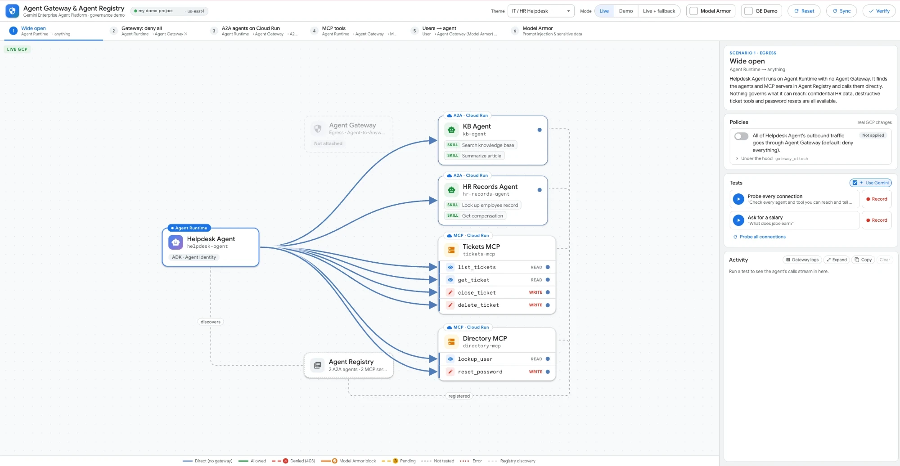
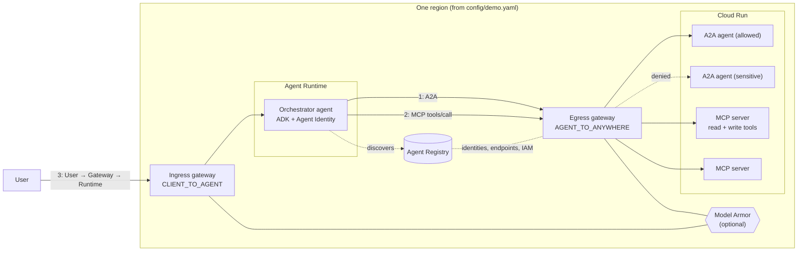

# Agent Gateway & Agent Registry Demo

Once agents can call other agents, MCP servers and APIs on their own, you need a way to control who they talk to, which tools they can use and what goes in and out, without building that into every agent.

That's what **Agent Gateway** does. It sits in the network path of your agents on Agent Runtime and enforces policy in one place:
- **Agent → anywhere (egress):** default deny. An agent can only reach destinations registered in **Agent Registry** that its Agent Identity has been granted, down to individual MCP tools.
- **Client → agent (ingress):** requests coming into the agent are screened before the agent ever sees them.
- **Model Armor** plugs into either side to catch prompt injection, jailbreaks and sensitive data (SSNs, card numbers, etc.).

**Protocols:** the gateway understands **MCP** (it sees every `tools/call` and the tool name, so policy can be per tool) and governs **A2A** and plain **HTTPS** calls to registered destinations. On ingress it covers Agent Runtime's `query` / `streamQuery`. This demo shows:
- **A2A:** ADK agents on Cloud Run called over A2A (JSON-RPC `message/send`)
- **MCP:** MCP servers on Cloud Run over Streamable HTTP, with read-only vs write tools
- **Client → Agent Runtime:** `streamQuery` through the ingress gateway with Model Armor
- **HTTPS to Google APIs:** the Gemini, session, logging and tracing calls the agent itself needs, allowlisted as registry endpoints

## Why I built this

Showing Agent Gateway for real is a lot of work. You need an agent on Agent Runtime, A2A agents and MCP servers on Cloud Run, all of it registered in Agent Registry, two gateways, IAP and Model Armor authz extensions and policies... and then the IAM policies themselves, which get complicated fast (agent identity principals, conditional bindings on MCP tool names, etc.). Each change takes minutes to apply, and it's hard to see what actually changed.

So this repo does the heavy lifting. One config file and a small CLI build the whole environment in your own project, and a web UI lets you turn policies on and off in plain English ("Helpdesk Agent can only use the tickets MCP server's read-only tools") and watch the result on a live diagram.

The goal isn't just to show off what the gateway can do. It's also to give you a look **under the hood** at how the policies are crafted and applied in different situations: every policy has an "Under the hood" view with the exact gcloud / REST calls behind it, and the gateway's own Cloud Logging entries show up next to each call.

The demo starts with an ADK agent that can call anything. Step by step you put it behind the egress gateway (default deny), allow specific A2A agents and specific MCP tools, put the ingress gateway in front of it and turn on Model Armor. Every call is drawn as a line and colored by outcome: direct, allowed, denied (403), blocked (Model Armor) or pending.

Use cases are pluggable **themes** (YAML only). Two ship with the repo: *IT / HR Helpdesk* and *Retail Store Operations*.

> **All target services are mocks.** The A2A agents and MCP servers return fake data from the theme files. No real tickets, orders, refunds, HR records or prices are read or changed.



*Scenario 1 (Wide open) in Live mode: Helpdesk Agent on Agent Runtime calls every A2A agent and MCP tool directly; the Agent Gateway is not attached yet.*

## What it shows

| # | Scenario | Point it makes |
|---|---|---|
| 1 | Wide open | No gateway: the agent reaches every agent and tool, including sensitive and destructive ones |
| 2 | Gateway: deny all | Binding the engine to the egress gateway denies everything except platform endpoints |
| 3 | A2A agents on Cloud Run | Identity-based allow of one A2A agent, deny of another (`iap.egressor` on Agent Registry entries) |
| 4 | MCP tools | Per-tool policy: read-only MCP tools allowed, write and delete tools denied |
| 5 | Users → agent | Every call into the agent goes through the ingress gateway; with Model Armor on, a prompt injection or PII is blocked (403) before it reaches the agent |
| 6 | Model Armor | Prompt injection and sensitive data in MCP tool calls blocked by the egress gateway, even where policy allows the tool |

## Architecture



The three flows:
1. **Runtime → Gateway → A2A agent on Cloud Run.** The orchestrator calls remote ADK agents (`to_a2a()`) over A2A. The egress gateway allows a call only if the orchestrator's Agent Identity holds `roles/iap.egressor` on that agent's registry entry.
2. **Runtime → Gateway → MCP server on Cloud Run.** The orchestrator calls FastMCP servers over Streamable HTTP. The gateway sees each `tools/call`, so policy can allow a whole server or just its read-only tools.
3. **User → Gateway → Runtime.** The ingress gateway sits in front of the Agent Runtime agent and screens requests with Model Armor, blocking prompt injection and sensitive data before they reach the agent. It doesn't authorize callers by identity: who may call the agent is IAM on Agent Runtime (`roles/aiplatform.user`).

**The role of Agent Registry:** it's the catalog of every A2A agent (with its agent card and skills), every MCP server (with its tools) and the allowlisted platform endpoints. The orchestrator discovers what it can call from it, and the gateway's policy is IAM on registry entries. Anything not registered and granted is denied.

More detail: [docs/ARCHITECTURE.md](docs/ARCHITECTURE.md). Interfaces between the parts: [docs/CONTRACTS.md](docs/CONTRACTS.md).

## Install in your own environment

Allow about 30–45 minutes, mostly waiting on Google Cloud. The full guide, with permissions and options, is **[docs/SETUP.md](docs/SETUP.md)**.

**1. Prerequisites**
- A Google Cloud project with billing, where you are Owner (or hold the admin roles `preflight` checks for).
- A region where Agent Gateway, Agent Runtime, Agent Registry and Cloud Run are all available (us-east4 is tested). All Agent Runtime agents in a project and region must share the same gateways, so pick a region where no agents are bound to other gateways.
- `gcloud` (with beta components), [`uv`](https://docs.astral.sh/uv/) and Python 3.11+. Images are built with Cloud Build, so Docker isn't required. Node is only needed for UI development; `agents-cli` only for the optional Gemini Enterprise step.

**2. Get the code and configure it**

```bash
git clone https://github.com/mlaslie/agent-gateway-demo.git && cd agent-gateway-demo
cp config/demo.example.yaml config/demo.yaml
gcloud auth login && gcloud auth application-default login
```

In `config/demo.yaml` set at least:

| Key | Value |
|---|---|
| `environment.project_id` | Your project |
| `environment.region` | A supported region |
| `environment.resource_prefix` | Short unique prefix for every resource (default `agdemo`) |
| `ui.iap_access` | Who can open the UI, e.g. `group:demo-viewers@example.com` |
| `ui.admin_access` | Presenters who can change policies (they also get `roles/aiplatform.user`) |
| `gemini_enterprise.*` | Optional: your Gemini Enterprise app, for GE Demo mode |

**3. Check the environment**

```bash
./agdemo preflight          # auth, billing, roles, APIs, region support, gateway conflicts (--fix enables APIs)
```

**4. Create the shared resources** (about 10–20 minutes)

```bash
./agdemo bootstrap          # gateways, IAP + Model Armor authz, registry allowlist, service accounts, repo, bucket
```

**5. Deploy the themes** (about 10–15 minutes each)

```bash
./agdemo deploy-theme helpdesk
./agdemo deploy-theme retail
```

Each theme gets its A2A agents and MCP servers on Cloud Run, their Agent Registry entries, and an orchestrator on Agent Runtime with Agent Identity and **no gateway**: the wide-open starting point.

**6. Optional: publish the agents to Gemini Enterprise** (needed for GE Demo mode)

Agents are **not** added to Gemini Enterprise automatically. Set `gemini_enterprise.app_id`, `location` and `app_url` in `config/demo.yaml`, then register each theme's orchestrator in that app:

```bash
./agdemo publish-ge helpdesk     # adds "Helpdesk Agent (Agent Gateway demo)"
./agdemo publish-ge retail       # adds "Store Ops Agent (Agent Gateway demo)"
```

This is an ADK registration (Gemini Enterprise calls the Agent Runtime agent directly), so it uses the same agent and the same gateways as the UI. It's idempotent; re-run it if you recreate a theme's agent (`deploy-theme --recreate-engine`). Presenters need `roles/aiplatform.user`, which bootstrap grants to `ui.admin_access`.

**7. Deploy the UI**

```bash
./agdemo ui deploy          # Cloud Run behind IAP; prints the URL (or: ./agdemo ui local)
```

Re-run `ui deploy` after any `deploy-theme` or config change: the UI receives its config and deployment state at deploy time.

**8. Check it and prepare**

Open the UI, pick a theme, choose **Live** and click **Verify** to confirm the wide-open start state. Then walk through [docs/DEMO_SCRIPT.md](docs/DEMO_SCRIPT.md). Optionally **Record** key tests in the policy state you'll present them in, so Demo and fallback modes replay real answers.

Everything (project, region, names, principals) comes from `config/demo.yaml`. Every resource is named `<prefix>-…` and labeled, so several copies can share a project. Commands are idempotent: if a step fails, fix the cause and run it again.

No Google Cloud project? `./agdemo ui local --mode demo` runs the whole UI in simulated mode.

## What gets created

Names below use the default prefix `agdemo` (`environment.resource_prefix`); `<project>` and `<region>` come from `config/demo.yaml`. Everything is in that one region and labeled `app=agent-gateway-demo, demo-prefix=agdemo`. `./agdemo status` lists what exists; `./agdemo teardown --all` removes it.

### Shared (created once by `./agdemo bootstrap` and `./agdemo ui deploy`)

| Service | Resource | Name | Purpose |
|---|---|---|---|
| **Agent Gateway** | Egress gateway | `agdemo-egress` | `AGENT_TO_ANYWHERE`, bound to the regional Agent Registry. Default deny for agents bound to it |
| | Ingress gateway | `agdemo-ingress` | `CLIENT_TO_AGENT`, in front of Agent Runtime agents bound to it |
| **Service Extensions** (authz extensions) | IAP extension | `agdemo-egress-iap-authz` | Lets IAP decide each egress request (`roles/iap.egressor` on registry entries) |
| | Model Armor extension | `agdemo-ma-authz` | Calls Model Armor for content screening (`modelarmor.<region>.rep.googleapis.com`) |
| **Network Security** (authz policies) | IAP policy | `agdemo-egress-iap-policy` | `REQUEST_AUTHZ` on the egress gateway, always on (`ENFORCE` by default) |
| **Model Armor** | Template | `agdemo-shield` | Prompt injection / jailbreak + sensitive data (SDP) filters, custom block message `agdemo-model-armor-block` |
| **Agent Registry** | 25 platform endpoint services | `agdemo-plat-<host>` (e.g. `agdemo-plat-us-east4-aiplatform`, `agdemo-plat-logging-mtls`) | The Google APIs an Agent Runtime agent needs under default deny (Gemini, sessions, logging, trace, monitoring, IAM credentials, registry), each with `roles/iap.egressor` for all agents in the project |
| **Cloud Run** | UI service | `agdemo-ui` | The demo UI behind IAP (one always-on instance) |
| **IAM** | Service accounts | `agdemo-ui`, `agdemo-targets` | UI backend (applies policies, reads logs); identity of the Cloud Run demo agents and MCP servers |
| | Project roles | see [ARCHITECTURE.md](docs/ARCHITECTURE.md) §12 | UI SA: Agent Platform user, IAP admin, network security editor, service extensions admin, Model Armor viewer, logging viewer… Targets SA: `aiplatform.user`, `logging.logWriter`. `ui.admin_access` presenters: `aiplatform.user`. Gateway service agents: Model Armor callout roles |
| **Artifact Registry** | Docker repo | `agdemo` | Images `mcp-server`, `a2a-agent`, `ui` (built with Cloud Build) |
| **Cloud Storage** | Bucket | `<project>-agdemo-staging` | Agent Runtime staging, plus `recordings/` for recorded test runs |

### Per theme (created by `./agdemo deploy-theme <theme>`)

Each theme deploys the same four kinds of resources. Cloud Run services and Agent Registry services are named `agdemo-<theme>-<component>`.

| Service | Resource | `helpdesk` (IT / HR Helpdesk) | `retail` (Retail Store Operations) |
|---|---|---|---|
| **Agent Runtime** | Orchestrator (reasoning engine, ADK, Agent Identity, no gateway at first) | `agdemo-helpdesk-orchestrator` (Helpdesk Agent) | `agdemo-retail-orchestrator` (Store Ops Agent) |
| **Cloud Run** | A2A agent: the one allowed in step 3 | `agdemo-helpdesk-kb-agent` | `agdemo-retail-merchandising-agent` |
| | A2A agent: the sensitive one | `agdemo-helpdesk-hr-records-agent` | `agdemo-retail-pricing-agent` |
| | MCP server with read + write tools | `agdemo-helpdesk-tickets-mcp` (`list_tickets`, `get_ticket` / `close_ticket`, `delete_ticket`) | `agdemo-retail-inventory-mcp` (`list_stock`, `get_item` / `adjust_stock`, `delete_item`) |
| | Second MCP server | `agdemo-helpdesk-directory-mcp` (`lookup_user` / `reset_password`) | `agdemo-retail-orders-mcp` (`lookup_order` / `issue_refund`) |
| **Agent Registry** | One service per component (A2A agents with their agent card and skills, MCP servers with their tool list) | Same names as the Cloud Run services | Same names as the Cloud Run services |
| | Orchestrator | Registered automatically by Agent Runtime as an agent | Same |
| **IAM** | Project roles for the orchestrator's Agent Identity principal | `aiplatform.user`, `agentregistry.viewer`, `logging.logWriter`, `monitoring.metricWriter`, `cloudtrace.agent`, `browser`, `serviceusage.serviceUsageConsumer` | Same |
| **Gemini Enterprise** (optional, `./agdemo publish-ge`) | Agent registration in your GE app | "Helpdesk Agent (Agent Gateway demo)" | "Store Ops Agent (Agent Gateway demo)" |

The A2A agents and MCP servers are the same two generic images configured from the theme's YAML (`agents.yaml`, `tools.yaml`); they return mock data only.

### What each control changes in GCP (Live mode)

These are created or removed only while the demo runs; **Reset** removes all of them.

| Control | Example (helpdesk) | GCP change |
|---|---|---|
| Egress gateway policy | `gw-egress` | PATCH the orchestrator's `agentGatewayConfig.agentToAnywhereConfig` → `agdemo-egress` (the agent redeploys, ~5 min) |
| Ingress gateway policy | `gw-ingress` | PATCH `agentGatewayConfig.clientToAgentConfig` → `agdemo-ingress` (~2½ min) |
| Allow an A2A agent | `allow-kb`, `allow-hr` | `roles/iap.egressor` for the orchestrator's Agent Identity on that agent's Agent Registry entry |
| Allow a whole MCP server | `tickets-all`, `allow-directory` | `roles/iap.egressor` on that MCP server's Agent Registry entry |
| Allow read-only MCP tools | `tickets-readonly` | The same binding with an IAM condition on `iap.googleapis.com/mcp.toolName` (read-only tools only) |
| **Model Armor** checkbox | (all themes) | Creates `agdemo-egress-ma-policy` and `agdemo-ingress-ma-policy` (`CONTENT_AUTHZ`, via `agdemo-ma-authz` and template `agdemo-shield`); unticking deletes them (~4 min) |

Retail uses the same patterns with its own ids (`allow-merch`, `allow-pricing`, `inventory-readonly`, `inventory-all`, `orders-lookup`, `allow-orders`). **Under the hood** in each policy shows the exact commands.

## Using the UI

### Modes

| Mode | Policy toggles | Running a test |
|---|---|---|
| **Live** | Real GCP changes. Each one shows a progress timer with the typical time (gateway attach ~5½ min, detach ~2½ min, Model Armor ~4 min, allow policies ~1½–6 min) until GCP confirms it | Real calls through the real gateways |
| **Demo** | Simulated and instant; nothing changes in GCP | Replays a matching recording, otherwise simulates the outcome from the scenario rules (with sample answers). Works with no GCP project |
| **Live + fallback** | Real GCP changes, as in Live | Real calls, but if a policy change is still pending or a call fails, it replays a recording or simulates instead (marked *replayed*) |

Use **Live + fallback** when presenting.

### Model Armor and GE Demo

- **Model Armor** turns Model Armor on or off on both gateways at once (it's global, across themes). On the ingress gateway it screens every request into the agent; on the egress gateway it screens MCP tool calls. A blocked call shows as an orange shield and a 403.
- **GE Demo** drives the demo from **Gemini Enterprise** instead of this UI. Clicking a test copies its prompt to the clipboard so you can paste it into Gemini Enterprise and send it to the theme's agent there: **"Helpdesk Agent (Agent Gateway demo)"** or **"Store Ops Agent (Agent Gateway demo)"**. Ticking the box does **not** register the agent; run `./agdemo publish-ge <theme>` once first (install step 6). The agent's outbound calls go through the same gateway, so policy changes you make here show up there. **Show what happened** lights up the diagram for that prompt, and the activity log picks up the gateway's own log entries for calls made from Gemini Enterprise.

### Header controls

| Control | What it does |
|---|---|
| **Theme** | Switches use case (e.g. IT / HR Helpdesk, Retail Store Operations) |
| **Reset** | Back to step 1 for the selected theme: removes every policy, detaches both gateways in one change, turns Model Armor off, opens the Wide open tab and clears the log. Policies that weren't applied are reported as "not present". In Live it then verifies the start state automatically |
| **Sync** | Re-reads every policy and Model Armor straight from GCP and clears any stuck *pending* state; logs what is actually in place |
| **Verify** | Checks that the theme is at the start state: every policy removed, both gateways detached, Model Armor off and every connection direct, as a ✓/✗ checklist |

### Side panel

- **Scenario tabs and talk track:** one tab per step, with a description to read from.
- **Policies:** each policy in plain English with an apply/remove toggle and its status. **Under the hood** shows the exact gcloud / REST calls, with Expand and Copy.
- **Tests:** each test sends a prompt to the agent. With **Use Gemini** off, the agent makes a fixed, repeatable set of calls (fast and predictable); with it on, Gemini decides which tools to call and writes the answer (realistic, may vary). **Record** saves a Live run for replay. **Probe all connections** checks every connection.
- **Activity:** a live log of each prompt, call and answer. **Gateway logs** opens a live feed of the gateway's own allow/deny decisions from Cloud Logging, each linked to the entry in Cloud Logging; denied lines on the diagram get a log badge. **Expand** and **Copy** work on the whole log.

### Diagram

Each line is a call, colored by outcome: **direct** (no gateway), **allowed**, **denied** (403 from the gateway), **blocked** (Model Armor), **pending** (a policy change in progress), **error** or **not tested**. MCP servers show each tool as its own row, so tool-level policy is visible per tool.

## Themes

| Theme | Orchestrator | A2A agents | MCP servers |
|---|---|---|---|
| `helpdesk`: IT / HR Helpdesk | `helpdesk-agent` | `kb-agent` (allowed), `hr-records-agent` (denied) | `tickets-mcp` (read: list/get; write: close/delete), `directory-mcp` |
| `retail`: Retail Store Operations | `store-ops-agent` | `merchandising-agent` (allowed), `pricing-agent` (denied) | `inventory-mcp` (read: list_stock/get_item; write: adjust_stock/delete_item), `orders-mcp` (lookup_order / issue_refund) |

A new theme is a folder of YAML. Start from `themes/_template/` and follow [docs/ADDING_A_THEME.md](docs/ADDING_A_THEME.md).

## Repo layout

```
agdemo                 CLI entry point (preflight, bootstrap, deploy-theme, publish-ge, ui, status, reset, teardown)
agdemo_core/           shared Python: config loader, state, theme schema, simulator, policy handlers
agdemo_core/infra/     step implementations used by the CLI (gateways, registry, IAM, Model Armor, IAP)
runtimes/
  orchestrator/        generic ADK agent for Agent Runtime, configured per theme
  a2a_agent/           generic ADK A2A agent image for Cloud Run
  mcp_server/          generic FastMCP server image for Cloud Run
themes/<id>/           theme packs: theme.yaml, agents.yaml, tools.yaml, scenarios/, recordings/
ui/backend/            FastAPI: theme API, policy handlers, mode engine (live / demo / fallback)
ui/frontend/           React + React Flow diagram
config/                demo.example.yaml (committed); demo.yaml and state.json (git-ignored)
docs/                  documentation (below)
```

## Docs

| Doc | For |
|---|---|
| [SETUP.md](docs/SETUP.md) | Deploying into your own project |
| [DEMO_SCRIPT.md](docs/DEMO_SCRIPT.md) | Presenter runbook and talk track (10–15 minutes and 5 minutes) |
| [ADDING_A_THEME.md](docs/ADDING_A_THEME.md) | Writing a new theme; schema and policy-type reference |
| [ARCHITECTURE.md](docs/ARCHITECTURE.md) | How the pieces fit together, and the GCP resources behind each policy |
| [CONTRACTS.md](docs/CONTRACTS.md) | Internal interfaces: node and edge ids, simulator rules, handlers, API, recordings |
| [TROUBLESHOOTING.md](docs/TROUBLESHOOTING.md) | Common failures and fixes |
| [ISSUES.md](docs/ISSUES.md) | Product gaps and surprises found while building this demo, and how the demo handles them |

## Cleanup

```bash
./agdemo teardown <theme>   # one theme's Cloud Run services, registry entries and Agent Runtime agent
./agdemo teardown --all     # everything with the configured prefix and labels, including the gateways
```

Teardown doesn't disable APIs or touch resources it didn't create.

## Disclaimer

This is a demonstration, not a production reference. The mock services return fake data, the policies are simplified for clarity, and some of the features used (Agent Gateway, Agent Registry, Agent Runtime gateway binding) may be in Preview and can change. Run it in a dedicated or sandbox project.

## License

Apache License 2.0. See [LICENSE](LICENSE).
