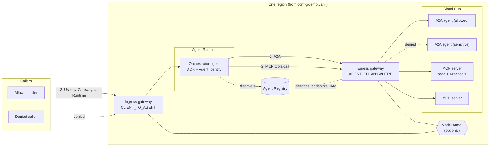

# Agent Gateway & Agent Registry Demo

An interactive, portable demo of governing AI agents on Google Cloud with **Agent Gateway** and **Agent Registry**. An ADK agent on **Agent Runtime** starts out able to call anything. Step by step, the presenter puts it behind an egress gateway (default deny), allows specific A2A agents and specific MCP tools by identity, controls who can call the agent through an ingress gateway, and turns on **Model Armor** to screen traffic. A web UI draws every call as a line on a diagram and colors it by outcome: direct, allowed, denied (403), blocked (Model Armor) or pending.

Use cases are pluggable **themes** (YAML only). Two ship with the repo: *IT / HR Helpdesk* and *Retail Store Operations*.

> **All target services are mocks.** The A2A agents and MCP servers return fake data from the theme files. No real tickets, orders, refunds, HR records or prices are read or changed.

## What it shows

| # | Scenario | Point it makes |
|---|---|---|
| 1 | Wide open | No gateway: the agent reaches every agent and tool, including sensitive and destructive ones |
| 2 | Gateway: deny all | Binding the engine to the egress gateway denies everything except platform endpoints |
| 3 | A2A agents on Cloud Run | Identity-based allow of one A2A agent, deny of another (`iap.egressor` on Agent Registry entries) |
| 4 | MCP tools | Per-tool policy: read-only MCP tools allowed, write and delete tools denied |
| 5 | Users → agent | The ingress gateway decides who may call the agent |
| 6 | Model Armor | Prompt injection and sensitive data blocked, even on allowed paths |

## Architecture



The three flows:
1. **Runtime → Gateway → A2A agent on Cloud Run.** The orchestrator calls remote ADK agents (`to_a2a()`) over A2A. The egress gateway allows a call only if the orchestrator's Agent Identity holds `roles/iap.egressor` on that agent's registry entry.
2. **Runtime → Gateway → MCP server on Cloud Run.** The orchestrator calls FastMCP servers over Streamable HTTP. The gateway sees each `tools/call`, so policy can allow a whole server or just its read-only tools.
3. **User → Gateway → Runtime.** The ingress gateway sits in front of the Agent Runtime agent and decides which principals may call it.

**The role of Agent Registry:** it's the catalog of every A2A agent (with its agent card and skills), every MCP server (with its tools) and the allowlisted platform endpoints. The orchestrator discovers what it can call from it, and the gateway's policy is IAM on registry entries. Anything not registered and granted is denied.

More detail: [docs/ARCHITECTURE.md](docs/ARCHITECTURE.md). Interfaces between the parts: [docs/CONTRACTS.md](docs/CONTRACTS.md).

## Quick start

Prerequisites, permissions and the full flow are in **[docs/SETUP.md](docs/SETUP.md)**. In short:

```bash
cp config/demo.example.yaml config/demo.yaml   # set project_id, region, prefix, principals
./agdemo preflight                             # checks auth, APIs, roles, region support, conflicts
./agdemo bootstrap                             # shared: gateways, registry, Model Armor, SAs (~10–20 min)
./agdemo deploy-theme helpdesk                 # Cloud Run targets + Agent Runtime orchestrator
./agdemo ui deploy                             # UI on Cloud Run behind IAP
```

No GCP project? `./agdemo ui local --mode demo` runs the whole UI from recordings and the simulator.

Everything (project, region, names, principals) comes from `config/demo.yaml`. Every resource is named `<prefix>-…` and labeled, so several copies can share a project.

## Modes

| Mode | Policy toggles | Run test |
|---|---|---|
| **Live** | Real GCP changes (they take effect in about 1–7 minutes, shown as *pending*) | Real calls to the agent |
| **Demo** | Simulated, instant | Replays recordings, or simulates from the scenario rules |
| **Live with fallback** | Real GCP changes | Real calls; replays a recording if a change is pending or a call fails |

## Themes

| Theme | Orchestrator | A2A agents | MCP servers |
|---|---|---|---|
| `helpdesk`: IT / HR Helpdesk | `helpdesk-agent` | `kb-agent` (allowed), `hr-records-agent` (denied) | `tickets-mcp` (read: list/get; write: close/delete), `directory-mcp` |
| `retail`: Retail Store Operations | `store-ops-agent` | `merchandising-agent` (allowed), `pricing-agent` (denied) | `inventory-mcp` (read: list_stock/get_item; write: adjust_stock/delete_item), `orders-mcp` (lookup_order / issue_refund) |

A new theme is a folder of YAML. Start from `themes/_template/` and follow [docs/ADDING_A_THEME.md](docs/ADDING_A_THEME.md).

## Repo layout

```
agdemo                 CLI entry point (preflight, bootstrap, deploy-theme, ui, status, reset, teardown)
agdemo_core/           shared Python: config loader, state, theme schema, simulator, policy handlers
infra/                 step implementations used by the CLI (gateways, registry, IAM, Model Armor, IAP)
runtimes/
  orchestrator/        generic ADK agent for Agent Runtime, configured per theme
  a2a_agent/           generic ADK A2A agent image for Cloud Run
  mcp_server/          generic FastMCP server image for Cloud Run
themes/<id>/           theme packs: theme.yaml, agents.yaml, tools.yaml, scenarios/, recordings/
ui/backend/            FastAPI: theme API, policy handlers, mode engine (live / demo / fallback)
ui/frontend/           React + React Flow diagram
config/                demo.example.yaml (committed); demo.yaml and state.json (git-ignored)
docs/                  documentation (below)
```

## Docs

| Doc | For |
|---|---|
| [SETUP.md](docs/SETUP.md) | Deploying into your own project |
| [DEMO_SCRIPT.md](docs/DEMO_SCRIPT.md) | Presenter runbook and talk track (10–15 minutes and 5 minutes) |
| [ADDING_A_THEME.md](docs/ADDING_A_THEME.md) | Writing a new theme; schema and policy-type reference |
| [ARCHITECTURE.md](docs/ARCHITECTURE.md) | How the pieces fit together, and the GCP resources behind each policy |
| [CONTRACTS.md](docs/CONTRACTS.md) | Internal interfaces: node and edge ids, simulator rules, handlers, API, recordings |
| [TROUBLESHOOTING.md](docs/TROUBLESHOOTING.md) | Common failures and fixes |
| [ISSUES.md](docs/ISSUES.md) | Product gaps and surprises found while building this demo, and how the demo handles them |

## Cleanup

```bash
./agdemo teardown <theme>   # one theme's Cloud Run services, registry entries and Agent Runtime agent
./agdemo teardown --all     # everything with the configured prefix and labels, including the gateways
```

Teardown doesn't disable APIs or touch resources it didn't create.

## Disclaimer

This is a demonstration, not a production reference. The mock services return fake data, the policies are simplified for clarity, and some of the features used (Agent Gateway, Agent Registry, Agent Runtime gateway binding) may be in Preview and can change. Run it in a dedicated or sandbox project.

## License

Apache License 2.0. See [LICENSE](LICENSE).
